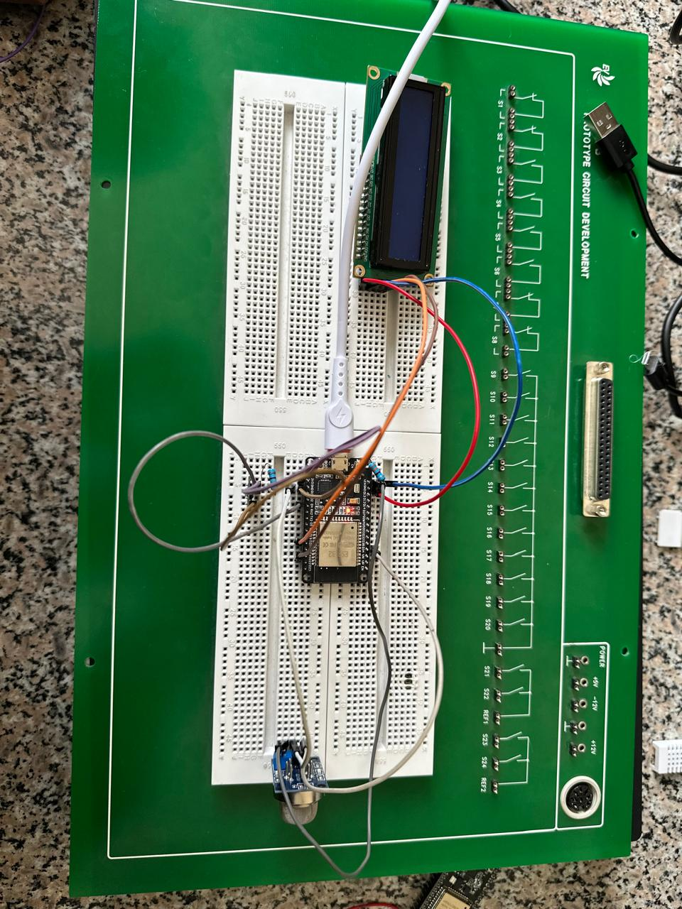
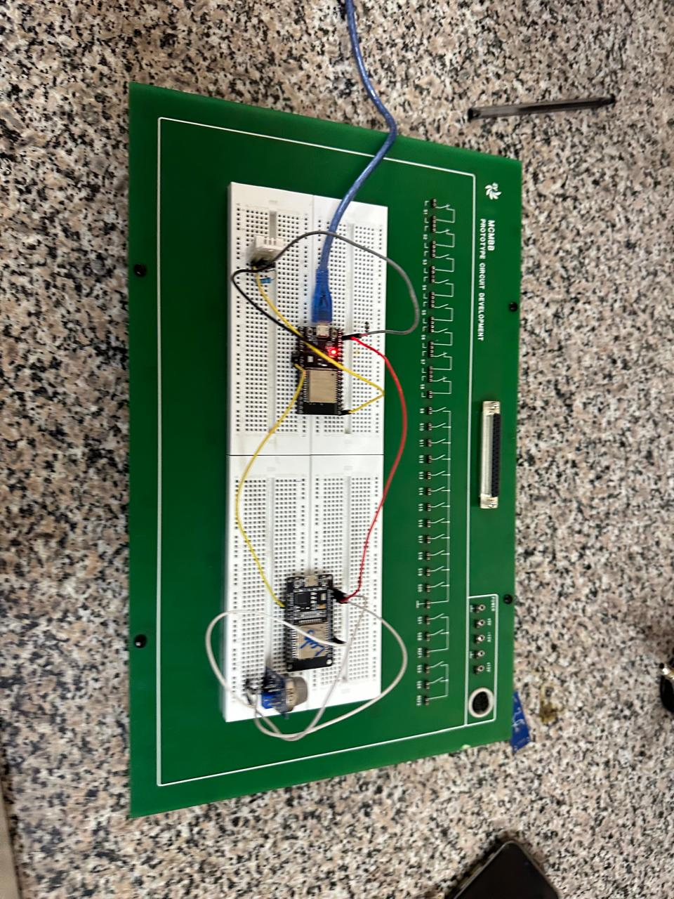
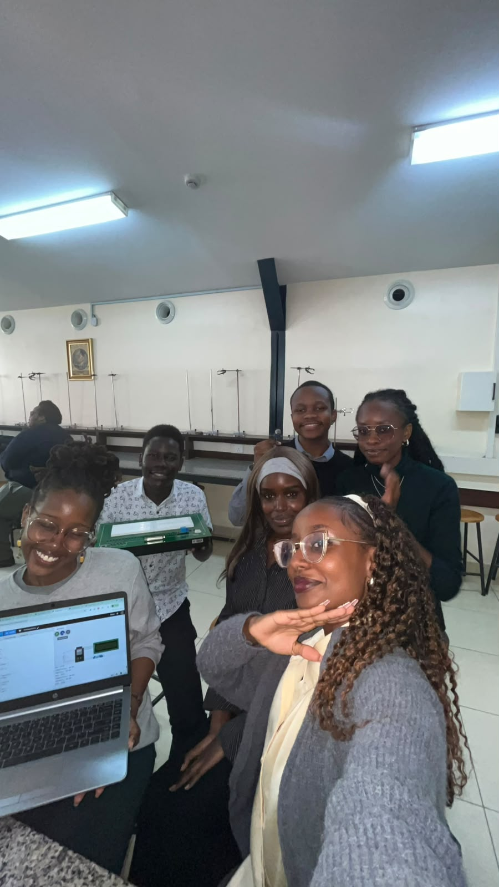

# ICS 4111: Embedded Systems and IoT — Semester Project: Deliverable 2

**Project:** Rose Greenhouse Monitoring System
**Team:** The Ohmies
**Team Members:** Rita Palmeris, Ian Tuitoek, Judah Ndivo, Tracy Mugure, Myra Nyamwanda, Naomi Teko

---

## 1. Objective

Develop physical and simulated prototypes of the embedded device architectures designed in Deliverable 1, based on our rose greenhouse monitoring system. Simulated prototypes were built and tested in Wokwi.

---

## 2. Architecture Overview

Per the assignment brief, three architectures were prototyped:

| Architecture | Description | Prototype Type Built |
|---|---|---|
| **(a)** | 1 ESP32 connected to 1 MQ-5, 1 DHT22, and 1 LCD | Physical **and** Simulated |
| **(b)** | 1 ESP32 (MQ-5) interfaced directly with another ESP32 (DHT22) | Physical |
| **(c)** | 1 ESP32 (DHT22) → Relay → 1 ESP32 (MQ-5) | Simulated |

Architectures (b) and (c) were built as interchangeable pairs per the assignment instructions — we built (b) physically and (c) as a simulation.

---

## 3. Architecture (a): ESP32 + MQ-5 + DHT22 + LCD

### 3.1 Physical Prototype

The physical build wires a single ESP32-S onto a breadboard with:
- 1x DHT22 temperature/humidity sensor (data pin → GPIO 4)
- 1x MQ-5 gas sensor (analog output → GPIO 34)
- 1x 16x2 I2C LCD display for on-device output

Current-limiting resistors were used on sensor and LCD backlight lines to protect components from overcurrent.

**Physical build:**




### 3.2 Simulated Prototype (Wokwi)

**Wokwi project link:** [Deliverable2a — ESP32 + MQ-5 + DHT22 + LCD](https://wokwi.com/projects/467164042972951553)

The simulation replicates the physical wiring: DHT22 on GPIO 4, MQ-5 analog output on GPIO 34, and a 16x2 I2C LCD (address `0x27`). The sketch alternates the LCD display every 3 seconds between temperature/humidity readings and gas sensor readings, flagging a `DANGER!` state on the LCD when the gas reading exceeds a threshold of 800, and `SAFE` otherwise. All readings are also logged to the serial monitor.

```cpp
#include <DHT.h>
#include <Wire.h>
#include <LiquidCrystal_I2C.h>

#define DHTPIN 4
#define DHTTYPE DHT22
#define MQ5_PIN 34

DHT dht(DHTPIN, DHTTYPE);
LiquidCrystal_I2C lcd(0x27, 16, 2);

void setup() {
  Serial.begin(115200);
  dht.begin();
  lcd.init();
  lcd.backlight();
}

void loop() {
  float temp = dht.readTemperature();
  float hum = dht.readHumidity();
  int gas = analogRead(MQ5_PIN);

  lcd.clear();
  lcd.setCursor(0, 0);
  lcd.print("Temp:");
  lcd.print(temp);
  lcd.setCursor(0, 1);
  lcd.print("Hum:");
  lcd.print(hum);
  delay(3000);

  lcd.clear();
  lcd.setCursor(0, 0);
  lcd.print("Gas:");
  lcd.print(gas);
  lcd.setCursor(0, 1);
  if (gas > 800) {
    lcd.print("DANGER!");
  } else {
    lcd.print("SAFE");
  }

  Serial.print("Temperature: ");
  Serial.println(temp);
  Serial.print("Humidity: ");
  Serial.println(hum);
  Serial.print("Gas: ");
  Serial.println(gas);
  delay(3000);
}
```

Full source: [`code/architecture-a/sketch.ino`](code/architecture-a/sketch.ino)

---

## 4. Architecture (b): ESP32 (MQ-5) ↔ ESP32 (DHT22)

### 4.1 Physical Prototype

This architecture uses two ESP32-S boards communicating directly with one another: one board reads the MQ-5 gas sensor, and the second reads the DHT22 temperature/humidity sensor. Readings from both boards are consolidated and displayed as output, with resistors used across all sensor connections to protect the boards.

**Physical build:**



**Output (IDE / display):**


---

## 5. Architecture (c): ESP32 (DHT22) → Relay → ESP32 (MQ-5)

### 5.1 Simulated Prototype (Wokwi)

**Wokwi project link:** [Deliverable2c — ESP32 (DHT22) → Relay → ESP32 (MQ-5)](https://wokwi.com/projects/467167380526893057)

This simulation uses two ESP32 DevKit boards linked through a relay module:

- **ESP32 #1** reads a DHT22 sensor (data on GPIO 4, powered from 3V3) and drives the relay's `IN` pin (GPIO 23).
- **Relay module** switches based on ESP32 #1's DHT22 readings, with its `NO` (Normally Open) contact wired to GPIO 15 on **ESP32 #2**, effectively passing a triggered signal across boards.
- **ESP32 #2** reads the MQ-5 gas sensor (analog output on GPIO 34) and receives the relay-triggered signal on GPIO 15.
- Both boards' TX/RX lines are connected to their respective serial monitors for logged output.

This architecture demonstrates inter-board communication mediated by a physical switching component (the relay) rather than direct GPIO-to-GPIO signaling as in architecture (b).

**Wiring diagram (from Wokwi `diagram.json`):**

| From | To | Wire Color |
|---|---|---|
| DHT22 VCC | ESP32 #1 3V3 | Red |
| DHT22 GND | ESP32 #1 GND | Black |
| DHT22 SDA | ESP32 #1 GPIO 4 | Green |
| Relay VCC | ESP32 #1 5V | Red |
| Relay GND | ESP32 #1 GND | Black |
| Relay IN | ESP32 #1 GPIO 23 | Green |
| Relay COM | ESP32 #1 3V3 | Green |
| Relay NO | ESP32 #2 GPIO 15 | Green |
| Relay COM | ESP32 #2 3V3 | Green |
| MQ-5 VCC | ESP32 #2 5V | Red |
| MQ-5 GND | ESP32 #2 GND | Black |
| MQ-5 AOUT | ESP32 #2 GPIO 34 | Green |
| ESP32 #2 GPIO 15 | ESP32 #1 GPIO 16 | Green |

---

## 6. Issues Encountered

During prototyping, the team ran into the following technical issues:

1. **IDE / library upload failures:** The Arduino IDE repeatedly failed to flash code onto the ESP32 boards due to persistent library dependency conflicts. This occurred even after standard troubleshooting steps (reinstalling libraries, checking board manager versions, using alternate USB ports/drivers). We worked around this by isolating the sketches with a minimal, verified library set and re-flashing individual boards separately rather than in batch.

2. **Faulty lab equipment:** Some of the physical components issued from the lab (sensors/jumper wires) were found to be faulty during testing, which slowed down assembly of the physical prototypes and required swapping components to isolate hardware faults from code/wiring faults.

3. **Wokwi dual-ESP32 simulation difficulty:** Getting two ESP32 boards to reliably interact within a single Wokwi simulation (architecture c) was difficult, since Wokwi's simulation environment is not natively designed for straightforward multi-board-to-multi-board signaling in the way physical hardware allows. We resolved this by routing the inter-board signal through the relay module's contacts rather than a direct GPIO link, and by carefully sequencing firmware assignment per board (`esp32_1.ino`, `esp32_2.ino`) in the diagram configuration.

No unresolved blocking issues remained at the time of submission; all four required prototypes (2 physical, 2 simulated) were completed.

---

## 7. Evidence of Groupwork

The team coordinated development and testing collaboratively. Evidence of this collaboration (chat discussions, task delegation, and commit history) is included below:




Team members and their primary contributions:

| Member | Contribution |
|---|---|
| Rita Palmeris | Architecture (a) & (c) Wokwi simulations, repo/documentation |
| Ian Tuitoek | Physical prototype assembly and testing |
| Judah Ndivo | Physical prototype assembly & testing |
| Tracy Mugure | Sensor calibration & testing |
| Myra Nyamwanda | Sensor calibration & testing |
| Naomi Teko |Physical prototype assembly & testing |

---

## 8. Summary

| Architecture | Physical | Simulated (Wokwi) |
|---|:---:|:---:|
| (a) ESP32 + MQ-5 + DHT22 + LCD | Completed | Completed [Link](https://wokwi.com/projects/467164042972951553) |
| (b) ESP32(MQ-5) ↔ ESP32(DHT22) | Completed | — |
| (c) ESP32(DHT22) → Relay → ESP32(MQ-5) | — | Completed [Link](https://wokwi.com/projects/467167380526893057) |

A total of **4 prototypes** were delivered: 2 physical (a, b) and 2 simulated (a, c), satisfying the deliverable requirements.